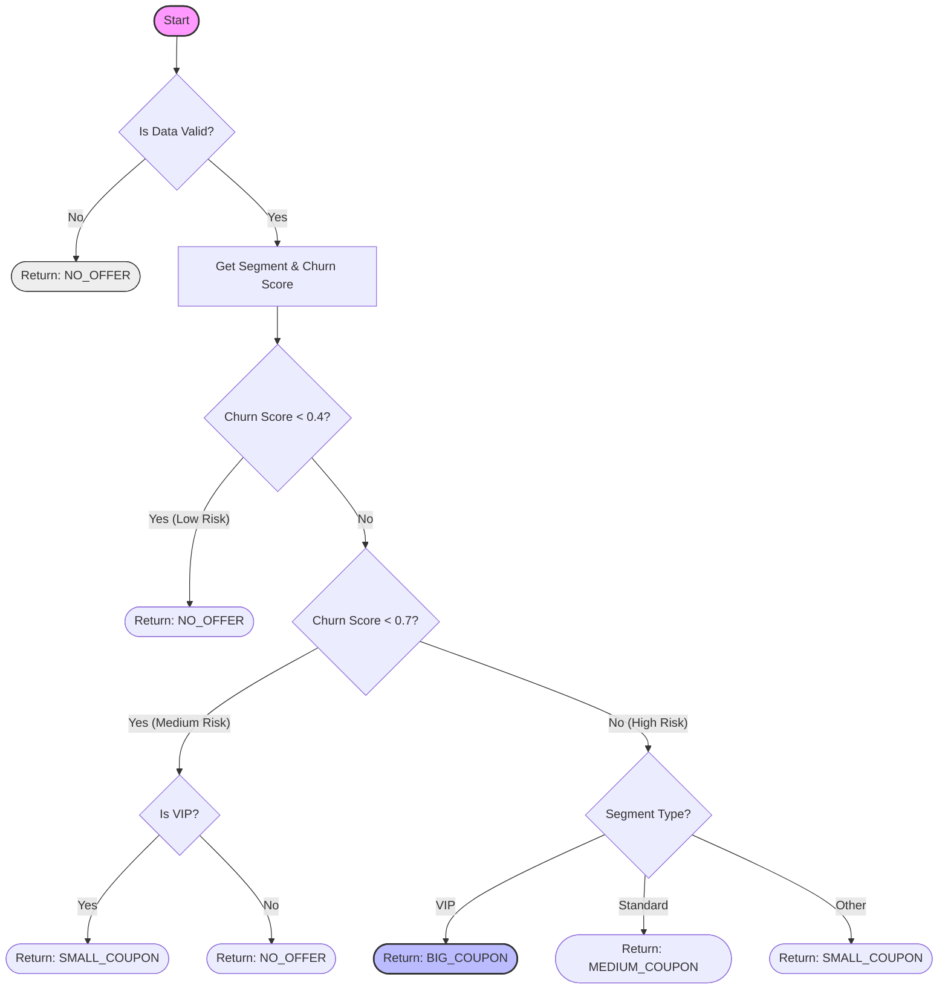

# Retention Policy Designer (Business Logic Lab)

A tiny GitHub Pages app where students design **business logic** (in the Instruction box) to control retention offers:
- Inputs: churn_score, segment, monthly_charges, tenure, contract
- Output: offer ∈ {NO_OFFER, SMALL, MEDIUM, BIG}

## What students edit
Students ONLY edit the **Instruction** text (pseudocode + Mermaid + the POLICY block).
The app parses the `[POLICY]` block and simulates outcomes on a CSV sample.

## Deploy to GitHub Pages
1. Push this repo to GitHub.
2. Settings → Pages → Deploy from branch → select `main` and `/root`.
3. Open the provided Pages URL.

## Data
`data/telco_sample.csv` is a small sample inspired by the Kaggle Telco churn dataset. [Kaggle dataset link](https://www.kaggle.com/datasets/blastchar/telco-customer-churn)


```markdown
# Business Logic: Customer Retention Strategy

This module defines the decision logic for automated retention offers. It translates business intent (churn prevention) into executable rules based on customer segments and churn scores.

## 1. Pseudocode (Logic Flow)

The core logic is designed to optimize budget allocation by targeting high-risk, high-value users.

```text
LOGIC: Decide Retention Offer

INPUT: user_id
OUTPUT: offer_code

Step 1: Verify Data Quality (Anti-Hallucination)
  SET is_valid = CHECK_DATA_QUALITY(user_id)
  IF is_valid is FALSE THEN
    RETURN "NO_OFFER" (Fail Safe)

Step 2: Get Customer Context
  SET segment = GET_SEGMENT(user_id)  (e.g., "VIP", "STANDARD")
  SET churn   = GET_CHURN_SCORE(user_id) (0.0 to 1.0)

Step 3: Apply Business Rules
  IF churn < 0.4 (Low Risk) THEN
    RETURN "NO_OFFER"
  
  ELSE IF churn < 0.7 (Medium Risk) THEN
    IF segment is "VIP" THEN
      RETURN "SMALL_COUPON"
    ELSE
      RETURN "NO_OFFER"
    END IF
  
  ELSE (High Risk >= 0.7) THEN
    CASE segment OF
      "VIP":      RETURN "BIG_COUPON"
      "STANDARD": RETURN "MEDIUM_COUPON"
      OTHER:      RETURN "SMALL_COUPON"
    END CASE
  END IF
```

## 2. Logic Flowchart

The following diagram visualizes the decision path:



## 3. Key Business Rules
| Condition | Segment | Offer | Rationale |
|-----------|---------|-------|-----------|
| **Churn < 0.4** | Any | None | Save budget on loyal users. |
| **Churn 0.4-0.7** | VIP | Small | Pre-emptive care for high-value users. |
| **Churn > 0.7** | VIP | Big | Critical intervention required. |
```
