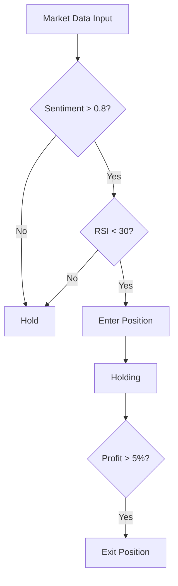

# 🏆 Crypto Trading AI Bot - Team Competition

## 📋 Overview

**Mission:** Design an optimal crypto trading strategy by combining news sentiment analysis with technical indicators.
**Objective:** Customize the provided n8n workflow logic to achieve the highest **Sharpe Ratio**.

**Resources:**
1.  **n8n Workflow (JSON):** Data Load → Batch API Call → Trading Logic → Backtest
2.  **Dataset:** 90 days of crypto price data (`crypto_features_3months.csv`) & news data (`crypto_news_3months.csv`)

**Evaluation:** **Sharpe Ratio (Risk-Adjusted Return)**
- Top 30%: 3 points (Full Score)
- Middle 40%: 2 points
- Bottom 30%: 0-1 points

---

## ⏱️ Schedule

- **Deadline:** **Monday, Feb 16, 2026 @ 23:59 (Midnight)**
- **Submission:** Submit your GitHub Repository link via [https://docs.google.com/spreadsheets/d/132fU_x4Ze-Dahll0CNVHZ1FJpiVsTaVszrEZMVbi09Q/edit?usp=sharing]

---

## 🎯 Your Tasks

Your goal is to modify the **`6. Final Logic & Metrics`** node within the provided n8n workflow (`Crypto-Trading-Bot-Simple-Batch-Fixed.json`) to implement your own strategy.

### 1. Strategy Design
Combine the following elements to create buy/sell signals:
- **News Sentiment:** `POSITIVE`, `NEGATIVE`, `NEUTRAL` labels and `sentiment_score` (0.0 to 1.0)
- **Technical Indicators:** RSI, Moving Averages (MA), Bollinger Bands, MACD, etc.
- **Risk Management:** Stop-loss, Take-profit, Position sizing (optional)

### 2. Implementation
Modify the JavaScript code in the **`6. Final Logic & Metrics`** node in n8n.
- Refine the `decision` logic (`buy` | `sell` | `hold`).
- Implement complex conditions (e.g., "Buy only if Sentiment > 0.9 AND RSI < 40").

### Current Baseline Logic Flowchart
This is the default logic currently implemented in the workflow.

```mermaid
graph TD
    Start([Input: Price, RSI, News]) --> CheckRSI_Low{RSI < 30?}

    %% 1. Technical Analysis (RSI)
    CheckRSI_Low -- Yes --> Buy[BUY (Reason: Oversold)]
    CheckRSI_Low -- No --> CheckRSI_High{RSI > 70?}

    CheckRSI_High -- Yes --> Sell[SELL (Reason: Overbought)]
    CheckRSI_High -- No --> CheckSentiment_Pos{News: POSITIVE<br/>AND Score > 0.85?}

    %% 2. Sentiment Analysis (News)
    CheckSentiment_Pos -- Yes --> Buy2[BUY (Reason: Positive News)]
    CheckSentiment_Pos -- No --> CheckSentiment_Neg{News: NEGATIVE<br/>AND Score > 0.85?}

    CheckSentiment_Neg -- Yes --> Sell2[SELL (Reason: Negative News)]
    CheckSentiment_Neg -- No --> Hold[HOLD]

    %% Color Styling
    style Buy fill:#d4edda,stroke:#28a745,stroke-width:2px
    style Buy2 fill:#d4edda,stroke:#28a745,stroke-width:2px
    style Sell fill:#f8d7da,stroke:#dc3545,stroke-width:2px
    style Sell2 fill:#f8d7da,stroke:#dc3545,stroke-width:2px
    style Hold fill:#e2e3e5,stroke:#6c757d,stroke-width:2px


---

## 📝 Submission Guide

You must submit a **GitHub Repository Link** containing the following files by the deadline.

### 📂 Required File Structure
```text
team-XX-crypto-bot/
├── README.md              ← Strategy Documentation (Must include Mermaid Chart)
├── workflow.json          ← Your modified n8n workflow file
├── trade_log.csv          ← Backtest results (Transaction history)
└── metrics.csv            ← Backtest results (Performance summary)
```

### 📄 README.md Template (Required)

```markdown
# Team XX - Crypto Trading Strategy

## 👥 Members
- [Name] - [Student ID]
- [Name] - [Student ID]

## 🧠 Strategy Overview

### Core Logic
Our strategy focuses on **[Trend Following / Mean Reversion / News-Based]** approaches.
1. **Entry Condition (Buy):** When News Sentiment > 0.8 AND RSI < 30
2. **Exit Condition (Sell):** When Sentiment drops below 0.2 OR Profit > 5%

### Decision Flowchart (Mermaid)


### Performance Analysis
*   **Sharpe Ratio:** **X.XX** (Most Important!)
*   Total Return: XX.X%
*   Max Drawdown: -XX.X%

**Strengths:**
*   (e.g., Defended well during market crashes)

**Limitations & Learnings:**
*   (e.g., Too many stop-losses in sideways markets)
```

---

## 💡 Tips for High Sharpe Ratio

1.  **Reduce Max Drawdown (MDD):** Even with high returns, a -50% drop will destroy your Sharpe Ratio. Implement stop-loss logic.
2.  **Avoid Over-trading:** Considering fees and slippage, fewer high-quality trades are often better than many weak trades.
3.  **Use Sentiment Scores:** Using the `sentiment_score` as a weight or filter can provide better timing than simple technical indicators alone.

---

## 🚨 Rules

1.  **No Plagiarism:** Copying code from other teams or using pre-made strategies from the internet will result in a 0 score.
2.  **No Data Manipulation:** Manually editing `trade_log.csv` or `metrics.csv` to fake results is prohibited. (We verify using your submitted `workflow.json`.)
3.  **Strict Deadline:** Commits pushed after Monday midnight will not be evaluated.
